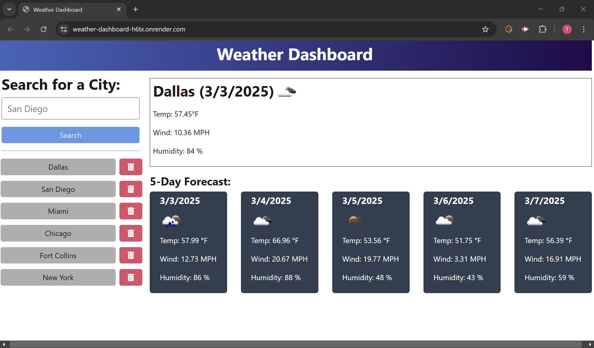
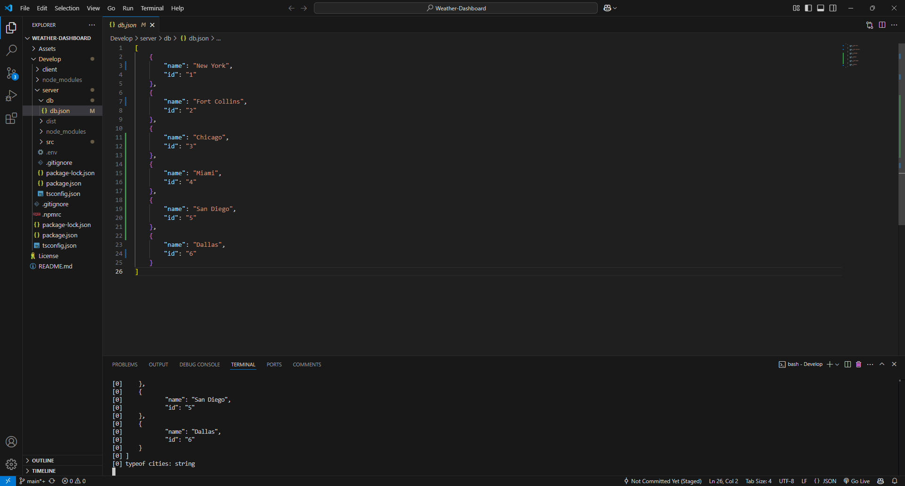

# Weather Dashboard

  

  ## Description
  This Weather Dashboard application provides users with the ability to view the current and future weather conditions of multiple cities. By integrating the OpenWeather API, the application retrieves real-time weather data and displays it in an intuitive and user-friendly interface.

  ## Table of Contents
  - [Installation](#installation)
  - [Usage](#usage)
  - [Screenshots](#screenshots)
  - [Walkthrough Video](#walkthrough-video)
  - [Contributing](#contributing)
  - [Contributors](#contributors)
  - [Tests](#tests)
  - [License](#license)
  - [Questions](#questions)

  ## Installation
  To install and set up the application, follow these steps: 

  1. Git clone: git@github.com:Treevyy/Weather-Dashboard.git

  2. Navigate to the project directory: cd WEATHER-DASHBOARD 

  3. Right click the root package.json file and click open in integrated terminal 

  4. Inside the terminal install the dependencies with the command: npm i 

  5. After dependencies are installed run the application with the command: npm run start:dev

  ## Usage
  Open the application in a web browser. Enter the name of a city in the search input. View the current weather conditions including: city name, date, weather icon & description, temperature, humidity, and wind speed. Will be able to view a 5-day weather forecast with: date, weather icon & description, temperature, wind speed and humidity. Click on a previously searched city from the search history to reload its weather details.

  ## Screenshots

  

  

  ## Walkthrough Video
  A demo of the application can be found at the following link: https://drive.google.com/file/d/1gu-uWzgSxAm7zvYZarnP5vv36eEb0-IA/view
  
  ## Contributing
  Contributions are welcome! If you would like to contribute to this project, please follow these steps: 

  1. Fork the repository

  2. Create a new branch (git checkout -b feature-branch)

  3. Commit your changes (git commit -m "Add new feature")

  4. Push to the branch (git push origin feature-branch)

  5. Open a pull request

  ## Contributors
  All of these TA's and tutors helped me revise and edit my code to function properly during office hours, and through tutoring sessions. Thank you for all your help!

  1. Treevyy aka Trevor Moore the main contributor to the assignment. 

  2. Quentin Jones TA

  3. Andrea Presto TA

  4. Joem Casusi Tutor

  5. Erik Hoversten Tutor

  ## Tests
  To run tests, use the following commands: 

  1. Open package.json at the root level 

  2. Open the terminal use command: npm i 

  3. In the same terminal run command: npm run start:dev

  ## License
  
  This project is licensed under the MIT license.

  ## Questions
  If you have any additonal questions, you can contact me at:
  - GitHub: [Treevyy](https://github.com/Treevyy)
  - Email: [aarontrevormoore@gmail.com](mailto:aarontrevormoore@gmail.com)